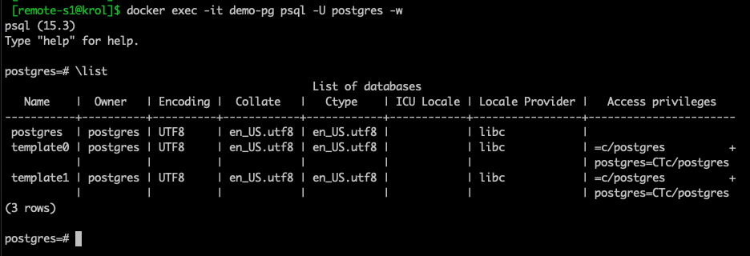

# Data Loss Prevention (DLP) using Postgresql

In this tutorial we will show how to connected with any database service from any private networking. You only need to install the hoop agent to get access and apply DLP by default.

## Prerequisites

- [Hoop agent installation](https://hoop.dev/docs/installing/command-line)
- [Docker installation](https://docs.docker.com/engine/install/)

## Step 1: Installing the database in the remote host

In this tutorial we use docker to create the Postgresql instance. 

> You can use any [Postgresql installation](https://www.postgresql.org/download/).

This command will create a Postgresql instance in the remote host "remote-s1" exposed with the port 5432

```
docker run --rm --name demo-pg -p 5432:5432 -e POSTGRES_PASSWORD=rootpw -d postgres:alpine3.17
```

Accessing the database instance

```
docker exec -it demo-pg psql -U postgres -w
```



## Step 2: Installing Hoop Agent in the remote host


Initialize the agent for the first time in the remote machine that contains the Postgresql instance using `hoop start agent`.


```
hoop start agent

{"level":"info","timestamp":"2023-08-10T12:40:57-03:00","logger":"agent/main.go:38","msg":"version=1.15.8, platform=linux/amd64, mode=webregister, grpc_server=app.hoop.dev:8443, tls=true - starting agent"}
{"level":"info","timestamp":"2023-08-10T12:40:57-03:00","logger":"agent/main.go:43","msg":"webregister - connecting, attempt=1"}

--------------------------------------------------------------------------
VISIT THE URL BELOW TO REGISTER THE AGENT
https://app.hoop.dev/agents/new/x-agt-xxxxxx-xxxx-xxxx-xxx-xxxxxxxxxxxxx
--------------------------------------------------------------------------

```

Using the **Hoop Url:** _http://app.hoop.dev/agents/new/x-agt-xxxx_ in the hoop platform, it will create an agent name "remote-s1".


After sucessfully register and authenticate the hoop agent in the machine with the Postgresql service, you can create the connection with the services running in the machine, in this case it will be a Postgresql.

## Step 3: Register the Connection Postgresql in Hoop

After saved the respective database credentials for the Postgresql, you can connect with this instance through Hoop.

> Setting the database credentials, in this sample the user is postgres using the db postgres.


## Step 4: Use the Hoop Connection to access the Postgresql

Connect to your remote database through Hoop

```
hoop connect my-postgres-remote01
connection: my-postgres-remote01 | session: c6e1f8f6-19ab-4b88-9f0a-9ba9208bfd8b

--------------------postgres-credentials--------------------
      host=127.0.0.1 port=5433 user=noop password=noop
------------------------------------------------------------
ready to accept connections!
{"level":"info","timestamp":"2023-08-10T13:54:32-03:00","logger":"proxy/pg.go:76","msg":"session=c6e1f8f6-19ab-4b88-9f0a-9ba9208bfd8b | conn=1 | client=127.0.0.1:61420 - connected"}
{"level":"info","timestamp":"2023-08-10T13:54:38-03:00","logger":"proxy/pg.go:76","msg":"session=c6e1f8f6-19ab-4b88-9f0a-9ba9208bfd8b | conn=2 | client=127.0.0.1:61429 - connected"}
```

### Using dbBeaver to connect with the Postgresql


> To use dbveaver, users need to configure the option preferQueryMode to simple. This option is available in the advanced tab of the connection. Check hoop documentation [here](https://hoop.dev/docs/connections/postgres)

## Step 5: Data Lost Prevention (DLP) Plugin

Create sensitive data to use the DLP Plugin

```

CREATE TABLE accounts (
	user_id serial PRIMARY KEY,
	username VARCHAR ( 50 ) UNIQUE NOT NULL,
	email VARCHAR ( 255 ) UNIQUE NOT NULL,
	created_on TIMESTAMP NOT NULL,
        last_login TIMESTAMP
);

INSERT INTO "accounts" (user_id, username, email, created_on, last_login) VALUES( 12345671, 'user01', 'my-email01@mycompany.com', current_timestamp, current_timestamp);

INSERT INTO "accounts" (user_id, username, email, created_on, last_login) VALUES( 12345672, 'user02', 'my-email02@gmail.com', current_timestamp, current_timestamp);
```

Hoop by default will apply DLP when you get access to the sensitive data.


> More about Hoop DLP [here](https://hoop.dev/docs/plugins/dlp/)

## Step 6: Audit SQL Queries


